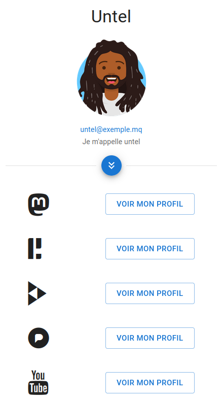

# Social Media Card

## Generate a card with your social media



### Required

- NodeJS 16+

- yarn or npm

### Copy env file and edit it

```
cp .env.sample .env
```

You can add more social media by editing the variable SOCIAL_MEDIA_LIST.
You must seprate words by comma : *SOCIAL_MEDIA_LIST=twitter,facebook,instagram,mastodon*

### Install dependencies
```
yarn
```

### Generate the json file with social media card content
```
yarn build-social-media-card-data
```
____

The background and the avatar are here ⬇️

*`public/images/avatar.png` made with [Avataaars Generator](https://getavataaars.com/)*

*`public/images/background.jpg` by [hubgib](https://pixabay.com/fr/users/hubgib-511643/) from [Pixabay](https://pixabay.com/images/id-490843/)* (Beach and Diamond Rock, Martinique)

**You can replace theses files by yours**

**⚠️ If you use different files, remember to change the names in the Background and Avatar components**

By default, all links redirect to the framalibre site. You have to edit the json file with your profile url. Just change `profileUrl`.

The icons come from Fork Awesome. If an icon is missing in this library, the value of `customIcon` changes to `no-icon.png`. You must replace it with your icon. In this case, the file must be placed in the `public/images/icons` directory.
____

## Dev

```
yarn dev
```

## Production
```
yarn build
```
```
yarn start
```

# 🌐 You can use the generated `out` directory (with *`yarn build`*) to deploy the app without needing a Node.js server.

`out` directory structure (`_next` folder content is omitted) ⬇️

```
├── 404.html
├── images
│	├── avatar.png
│	├── background.jpg
│	├── icons
│	│	└── no-icon.png
│	└── social-media-card-capture.png
├── index.html
└── _next
```
